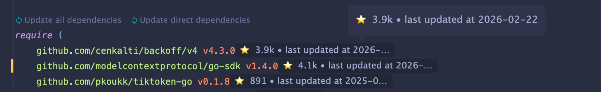
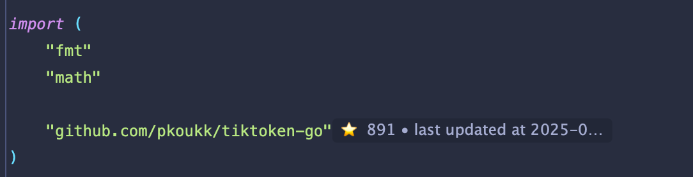

# DepLens

[English](./README.md) ｜ 中文 

DepLens 是一个在 IDE 内 **展示第三方依赖可靠性** 的插件，帮助开发者在AI辅助编码时快速判断引入的依赖库是否值得信任。

当你在项目中使用第三方依赖时，DepLens 会自动分析依赖对应的仓库信息，并在 IDE 中展示一些关键指标，例如：

* ⭐ GitHub Star 数
* 🕒 仓库最近更新时间

通过这些信息，开发者可以更直观地判断一个依赖是否：

* 长期维护
* 仍然活跃
* 可能已经废弃

从而降低使用不可靠依赖带来的风险。

---

# Features

目前已实现：

* 在 **JetBrains IDE** 中分析 **Go modules**
* 自动解析依赖对应的 GitHub 仓库
* 在 IDE 中 **内联展示仓库信息（Inlay Hint）**

    * GitHub Star 数
    * 最近更新时间
* 帮助开发者快速识别：

    * 冷门依赖
    * 长期未维护的依赖

示例：

---

# Roadmap

DepLens 计划逐步扩展到更多语言和 IDE。

| Language | JetBrains IDEs | VS Code    |
|----------|----------------|------------|
| Go       | ✅ Supported    | 🚧 WIP     |
| JS/TS    | 🚧 WIP          | 📅 Planned |
| Java     | 📅 Planned      | 📅 Planned |
| Kotlin   | 📅 Planned      | 📅 Planned |